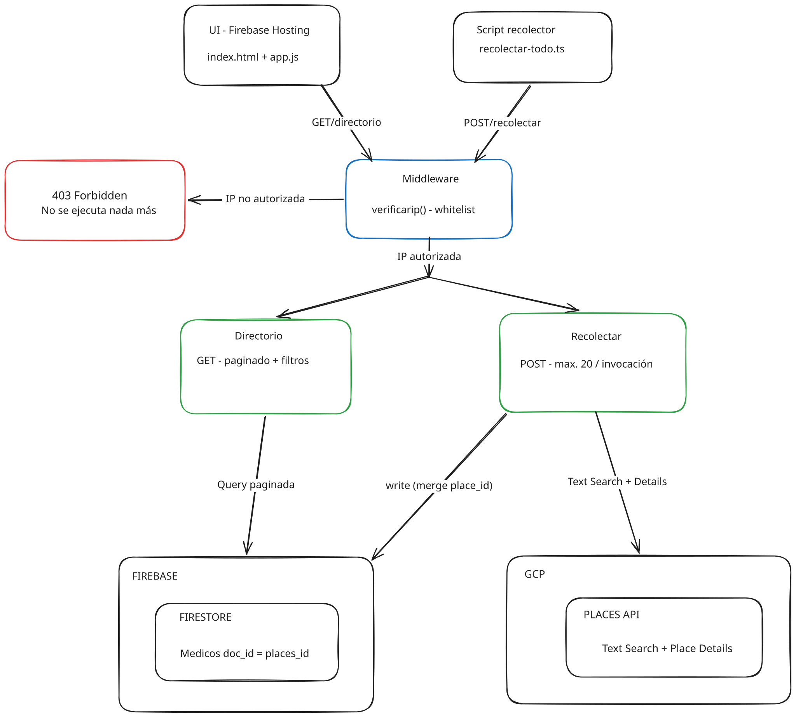
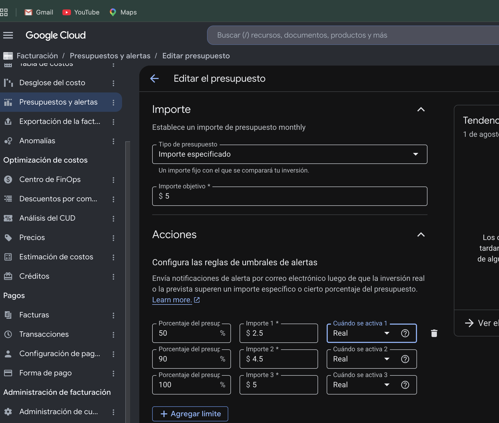

# Documentación Técnica

Proyecto 1: Directorio de Médicos Especialistas, CC3106 Responsible AI, UVG.
Cliente: Ministerio de Educación de Guatemala. Equipo de 4 personas.

## 1. Resumen del proyecto

El Ministerio de Educación necesita un directorio de médicos especialistas en
Ciudad de Guatemala (nombre, especialidad, dirección, teléfono, sitio web).
El equipo construyó el sistema que recolecta esos datos desde Google
Places API, los almacena en Firestore, y los expone a través de una
API paginada y una interfaz web mínima.

Stack: TypeScript, Firebase Functions v2, Firestore, Google Places API,
Firebase Hosting. Desarrollo con el emulador de Firebase; producción para
pruebas finales y demo.

## 2. Arquitectura

El sistema tiene tres etapas claramente separadas:

1. **Recolecta**, `POST /recolectar` recibe `keyword` + `zona`, consulta
   Google Places API (Text Search + Place Details) y escribe hasta 20
   resultados por invocación en Firestore.
2. **Almacena**, Firestore, colección `medicos`, con `place_id` como ID de
   documento para deduplicar automáticamente.
3. **Expone**, `GET /directorio` consulta únicamente Firestore (nunca llama
   a Places API en vivo), pagina y filtra por `especialidad` y `zona`. La UI
   en Firebase Hosting llama a este endpoint.

Ambos endpoints pasan primero por el mismo middleware de whitelist de IP:
si la IP del request no está autorizada, responde `403` sin ejecutar nada
más; ninguna llamada a Firestore ni a Places API ocurre en ese caso.

## 3. Estrategia de recolección

La query se construye como `{keyword} zona {zona} Guatemala`
(ej. `cardiólogo zona 10 Guatemala`).

Para cubrir la nomenclatura inconsistente de Google Maps, se buscan dos
patrones léxicos por especialidad: el practicante (`cardiólogo`) y la
forma de clínica (`clínica cardiológica`). La matriz completa cubre 20
especialidades × 6 zonas × 2 patrones = 240 combinaciones.

En Firestore, el campo `especialidad` guarda siempre el nombre canónico
del catálogo (ej. `"Cardiología"`), independientemente de qué patrón léxico
encontró el lugar; así la API de consulta filtra sin tener que mapear
variantes. El `keyword_usado` (query textual completa) se guarda aparte
como auditoría.

Deduplicación: `place_id` de Google como ID de documento, con
`set(..., {merge: true})`. Recolectar la misma combinación dos veces
actualiza, no duplica.

Zonas cubiertas: 1, 9, 10, 14, 15, 16. Especialidades: ver
[docs/keywords.md](keywords.md) para el catálogo completo de 20.

## 4. Seguridad

- **IP whitelist como middleware**: lista de IPs autorizadas vía variable de
  entorno `ALLOWED_IPS`; si la IP no está en la lista, `403` inmediato.
- **API key de Google Places**: nunca en el código fuente. Se maneja en dos
  capas, `PLACES_API_KEY` como secreto de Google Secret Manager en
  producción (`firebase functions:secrets:set`), y en `.env.local`
  (ignorado por git) para desarrollo con el emulador.
- **Restricción de la API key, decisión documentada**: el enunciado pide
  restringir la key por IP en la consola de GCP. En la práctica, las Cloud
  Functions no tienen una IP de salida fija, Google asigna una IP dinámica
  y compartida para las llamadas salientes de la función. Al restringir la
  key por IP, las llamadas reales a Places API desde `recolectar` fallaban
  con `REQUEST_DENIED` (verificado directamente en logs de producción).
  Lograr una IP de salida estática requiere un VPC connector + Cloud NAT,
  con un costo recurrente (~$30-70/mes) desproporcionado para el
  presupuesto de $5 del proyecto. Se optó por restringir la key solo por
  API (Places API legacy + New, ninguna otra), sin restricción de IP;
  la misma lógica de costo-beneficio que el enunciado ya permite
  explícitamente para la alternativa de Cloud Armor.

## 5. Costos y responsabilidad

- Alerta de billing configurada al 50% y 90% de un presupuesto de $5.
- Cuota diaria configurada en ambas Places API (legacy y New): 250
  requests/día cada una.

## 6. Postura ética

- **No se infieren ni rellenan datos.** Si Places no devuelve `website` o
  teléfono, el campo queda `""`; nunca se completa con información no
  provista por la API.
- **`sitio_web` puede apuntar a redes sociales o no ser el sitio oficial de
  la clínica.** Places no distingue esto; se guarda tal cual lo devuelve
  la API.
- **El directorio es una referencia, no una validación médica.** La API no
  verifica credenciales profesionales. Cada registro incluye
  `fecha_recoleccion` para que quede claro cuándo se capturó el dato.
- **Los datos no se redistribuyen como producto independiente.** El uso de
  Google Places API está sujeto a sus Términos de Servicio; este proyecto
  tiene alcance estrictamente académico. Una puesta en producción real
  requeriría un acuerdo comercial con Google.
- **La restricción de IP de la API key se relajó por una limitación técnica
  real**, no por conveniencia; ver sección 4. Se documenta la decisión en
  vez de dejarla implícita.
