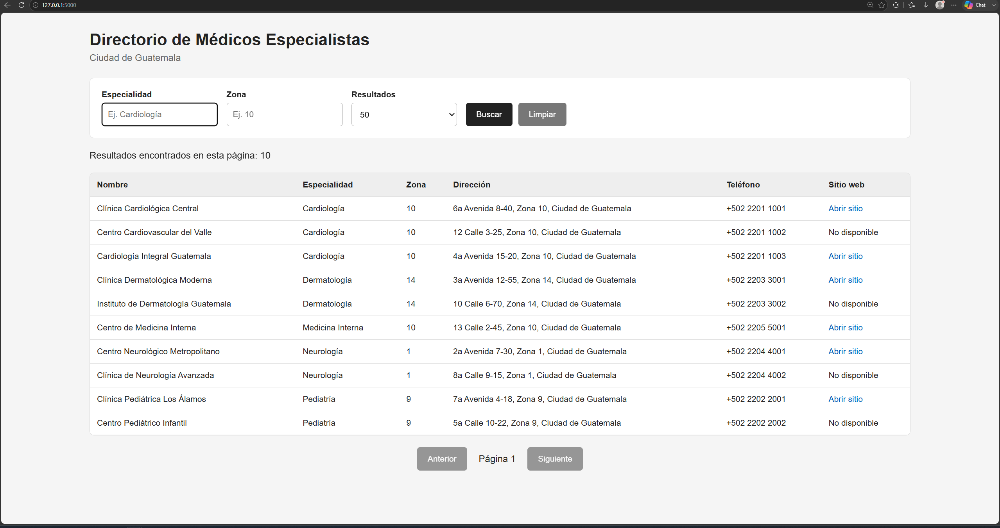

# Semana 3 — API funcional y UI de demo

# 1. Objetivo de la Semana 3

Durante la Semana 3 se completó la parte de consulta y visualización del directorio.

El objetivo principal fue implementar:

- Una API HTTP `GET /directorio`.
- Filtros por `especialidad` y `zona`.
- Paginación mediante `page` y `pageSize`.
- Límite máximo de `pageSize = 50`.
- Consulta de los registros almacenados en Firestore.
- Reutilización de la IP whitelist implementada en Semana 1.
- Una interfaz web mínima para la demo.
- Firebase Hosting para servir la interfaz.
- Integración entre la UI y la Cloud Function `directorio`.

El flujo final de Semana 3 es:

```text
Usuario
   |
   v
Firebase Hosting
public/index.html
   |
   | GET /directorio
   v
Cloud Function directorio
   |
   v
IP whitelist
   |
   v
Firestore Emulator
colección: medicos
   |
   v
Filtros + paginación
   |
   v
Respuesta JSON
   |
   v
Tabla HTML
```

---

# 2. Funcionalidades implementadas

La API permite realizar las siguientes consultas:

```text
GET /directorio
GET /directorio?zona=10
GET /directorio?especialidad=Cardiología
GET /directorio?zona=10&especialidad=Cardiología
GET /directorio?page=1&pageSize=10
```

Parámetros soportados:

| Parámetro       | Descripción                                              |
| ---------------- | --------------------------------------------------------- |
| `page`         | Número de página. Valor inicial:`1`.                  |
| `pageSize`     | Cantidad de resultados por página. Valor inicial:`10`. |
| `especialidad` | Filtra por especialidad médica.                          |
| `zona`         | Filtra por zona.                                          |

El valor máximo permitido para `pageSize` es `50`.

Si se solicita un número mayor, la API lo reduce automáticamente a 50.

---

# 3. Archivos modificados en Semana 3

## 3.1 `functions/src/firestore.ts`

Este archivo ya existía desde Semana 2.

Durante Semana 3 se amplió para incluir la lógica de consulta del directorio.

Antes su responsabilidad principal era:

```text
guardar resultados de Google Places
+
deduplicar utilizando place_id
```

Ahora también realiza:

```text
consultas a la colección medicos
+
filtro por especialidad
+
filtro por zona
+
paginación
```

Se agregaron las interfaces:

```typescript
FiltrosDirectorio
ResultadoDirectorio
```

y la función:

```typescript
consultarDirectorio()
```

Esta función recibe:

```text
page
pageSize
especialidad
zona
```

y devuelve:

```text
resultados
cantidad
haySiguiente
```

La colección consultada continúa siendo:

```text
medicos
```

---

## 3.2 `functions/src/index.ts`

Este archivo también existía antes de Semana 3.

Anteriormente contenía:

```text
helloWorld
recolectar
IP whitelist
```

Durante Semana 3 se agregó una nueva Cloud Function:

```typescript
export const directorio = onRequest(...)
```

La función `directorio`:

1. Verifica la IP.
2. Valida que el método HTTP sea `GET`.
3. Lee los parámetros de la URL.
4. Valida `page`.
5. Valida `pageSize`.
6. Limita `pageSize` a máximo 50.
7. Lee `especialidad`.
8. Lee `zona`.
9. Ejecuta `consultarDirectorio()`.
10. Devuelve los resultados en JSON.

Ejemplo de respuesta:

```json
{
  "page": 1,
  "pageSize": 10,
  "cantidad": 10,
  "haySiguiente": true,
  "filtros": {
    "especialidad": "Cardiología",
    "zona": "10"
  },
  "resultados": []
}
```

---

# 4. Archivos nuevos de Semana 3

## 4.1 `public/index.html`

Ubicación:

```text
P1RAI/
└── public/
    └── index.html
```

Este archivo contiene la interfaz principal del directorio.

Incluye:

- Campo de especialidad.
- Campo de zona.
- Selector de cantidad de resultados.
- Botón Buscar.
- Botón Limpiar.
- Tabla de resultados.
- Botón Anterior.
- Botón Siguiente.
- Indicador de página actual.

La interfaz es intencionalmente sencilla porque el requerimiento de Semana 3 solicita una UI mínima para demostración.

---

## 4.2 `public/styles.css`

Ubicación:

```text
P1RAI/
└── public/
    └── styles.css
```

Este archivo contiene los estilos visuales básicos de la interfaz.

Se utiliza para:

- Organizar el formulario.
- Mostrar la tabla de resultados.
- Dar formato a botones.
- Mostrar la paginación.
- Hacer la interfaz adaptable a pantallas pequeñas.

---

## 4.3 `public/app.js`

Ubicación:

```text
P1RAI/
└── public/
    └── app.js
```

Este archivo contiene la lógica del frontend.

Sus principales responsabilidades son:

```text
leer filtros
+
construir URL
+
ejecutar GET /directorio
+
mostrar resultados
+
controlar paginación
```

Ejemplo de URL construida:

```text
/directorio?page=1&pageSize=10&especialidad=Cardiología&zona=10
```

También controla:

```text
Anterior
Siguiente
Limpiar
Buscar
```

---

# 5. Archivo `firebase.json`

Durante Semana 3 se agregó Firebase Hosting.

La configuración principal añadida fue:

```json
"hosting": {
  "public": "public",
  "ignore": [
    "firebase.json",
    "**/.*",
    "**/node_modules/**"
  ],
  "rewrites": [
    {
      "source": "/directorio",
      "function": {
        "functionId": "directorio",
        "region": "us-central1"
      }
    }
  ]
}
```

Esto permite que la interfaz pueda consultar:

```text
/directorio
```

sin tener que escribir directamente la URL completa de Functions.

También se agregó el emulador de Hosting en el puerto `5000`.

---

# 6. Estructura del proyecto después de Semana 3

```text
P1RAI/
│
├── firebase.json
├── firestore.rules
├── firestore.indexes.json
│
├── public/
│   ├── index.html
│   ├── styles.css
│   └── app.js
│
└── functions/
    │
    ├── src/
    │   ├── index.ts
    │   ├── firestore.ts
    │   ├── places.ts
    │   └── keywords.ts
    │
    ├── scripts/
    │   ├── recolectar-todo.ts
    │   └── cargar-datos.js
    │
    ├── package.json
    ├── package-lock.json
    ├── tsconfig.json
    └── .eslintrc.js
```

---

# 7. Preparación antes de ejecutar

Entrar a la carpeta del proyecto:

```powershell
cd "C:\Fichero\Universidad\10 Semestre\RESPONSIBLE AI\P1RAI"
```

Verificar proyecto Firebase activo:

```powershell
firebase use
```

Debe mostrar:

```text
Active Project: p1ain-a2015
```

---

# 8. Compilar Functions

Entrar a:

```powershell
cd "C:\Fichero\Universidad\10 Semestre\RESPONSIBLE AI\P1RAI\functions"
```

Ejecutar:

```powershell
npm run build
```

Resultado esperado:

```text
> build
> tsc
```

sin errores.

---

# 9. Revisar ESLint

Ejecutar:

```powershell
npm run lint
```

Para corregir automáticamente problemas compatibles con `--fix`:

```powershell
npm run lint -- --fix
```

En Windows se deshabilitó la regla estricta de saltos de línea:

```javascript
"linebreak-style": "off"
```

y se puede utilizar:

```javascript
"max-len": ["error", {"code": 120}]
```

para permitir líneas de hasta 120 caracteres.

---

# 10. Levantar los emuladores

Regresar a la raíz:

```powershell
cd ..
```

Ejecutar:

```powershell
firebase emulators:start --only functions,firestore,hosting
```

Servicios esperados:

```text
Functions   127.0.0.1:5001
Firestore   127.0.0.1:8080
Hosting     127.0.0.1:5000
UI          127.0.0.1:4000
```

Cloud Functions disponibles:

```text
helloWorld
recolectar
directorio
```

---

# 11. URLs utilizadas

## Firebase Emulator Suite

```text
http://127.0.0.1:4000
```

## Firestore

```text
http://127.0.0.1:4000/firestore
```

Desde PowerShell:

```powershell
Start-Process "http://127.0.0.1:4000/firestore"
```

## UI del directorio

```text
http://127.0.0.1:5000
```

Desde PowerShell:

```powershell
Start-Process "http://127.0.0.1:5000"
```

## API directa

```text
http://127.0.0.1:5001/p1ain-a2015/us-central1/directorio
```

---

# 12. Configuración UTF-8 en PowerShell

Se detectó durante las pruebas que PowerShell estaba enviando caracteres como:

```text
Cardiolog�a
cardi�logo
```

en lugar de:

```text
Cardiología
cardiólogo
```

Para solucionarlo se configuró PowerShell en UTF-8:

```powershell
[Console]::InputEncoding = [System.Text.UTF8Encoding]::new()
[Console]::OutputEncoding = [System.Text.UTF8Encoding]::new()
$OutputEncoding = [System.Text.UTF8Encoding]::new()
chcp 65001
```

Prueba:

```powershell
"cardiólogo"
"Cardiología"
```

Debe mostrar correctamente ambos textos.

Al enviar JSON se recomienda:

```powershell
-ContentType "application/json; charset=utf-8"
```

---

# 13. Cargar datos mediante `recolectar`

Crear body:

```powershell
$body = @{
    keyword = "cardiólogo"
    zona = "10"
    especialidad = "Cardiología"
} | ConvertTo-Json
```

Ejecutar:

```powershell
Invoke-RestMethod `
  -Uri "http://127.0.0.1:5001/p1ain-a2015/us-central1/recolectar" `
  -Method POST `
  -ContentType "application/json; charset=utf-8" `
  -Body $body
```

Ejemplo de resultado obtenido:

```text
keyword_usado : cardiólogo zona 10 Guatemala
total         : 20
insertados    : 20
actualizados  : 0
```

---

# 14. Cargar datos ficticios desde terminal

También se creó un script opcional:

```text
functions/scripts/cargar-datos.js
```

Para ejecutarlo:

```powershell
cd "C:\Fichero\Universidad\10 Semestre\RESPONSIBLE AI\P1RAI\functions"
node scripts/cargar-datos.js
```

Este script carga datos directamente en el Firestore Emulator (`127.0.0.1:8080`) y utiliza `place_id` como ID de cada documento para evitar duplicados.

---

# 15. Pruebas de la API

## 15.1 Primera página

```powershell
Invoke-RestMethod `
  -Uri "http://127.0.0.1:5001/p1ain-a2015/us-central1/directorio?page=1&pageSize=5" `
  -Method GET
```

Resultado observado:

```text
page         : 1
pageSize     : 5
cantidad     : 5
haySiguiente : True
```

## 15.2 Segunda página

```powershell
Invoke-RestMethod `
  -Uri "http://127.0.0.1:5001/p1ain-a2015/us-central1/directorio?page=2&pageSize=5" `
  -Method GET
```

Con 7 registros, el resultado observado fue:

```text
page         : 2
pageSize     : 5
cantidad     : 2
haySiguiente : False
```

## 15.3 Filtro por zona

```powershell
Invoke-RestMethod `
  -Uri "http://127.0.0.1:5001/p1ain-a2015/us-central1/directorio?zona=10&page=1&pageSize=10" `
  -Method GET
```

## 15.4 Filtro por especialidad

```powershell
$especialidad = [uri]::EscapeDataString("Cardiología")

Invoke-RestMethod `
  -Uri "http://127.0.0.1:5001/p1ain-a2015/us-central1/directorio?especialidad=$especialidad&page=1&pageSize=10" `
  -Method GET
```

## 15.5 Filtro combinado

```powershell
$especialidad = [uri]::EscapeDataString("Cardiología")

Invoke-RestMethod `
  -Uri "http://127.0.0.1:5001/p1ain-a2015/us-central1/directorio?especialidad=$especialidad&zona=10&page=1&pageSize=10" `
  -Method GET
```

## 15.6 Probar límite máximo de `pageSize`

```powershell
Invoke-RestMethod `
  -Uri "http://127.0.0.1:5001/p1ain-a2015/us-central1/directorio?page=1&pageSize=500" `
  -Method GET
```

El resultado debe indicar:

```text
pageSize : 50
```

---

# 16. Probar método HTTP incorrecto

La función `directorio` solamente acepta `GET`.

```powershell
Invoke-WebRequest `
  -Uri "http://127.0.0.1:5001/p1ain-a2015/us-central1/directorio" `
  -Method POST `
  -SkipHttpErrorCheck
```

La respuesta esperada es `HTTP 405`.

---

# 17. Pruebas de la UI

Abrir:

```powershell
Start-Process "http://127.0.0.1:5000"
```

Probar los siguientes escenarios:

### Sin filtros

```text
Especialidad: vacío
Zona: vacío
Resultados: 10
```

### Cardiología

```text
Especialidad: Cardiología
Zona: vacío
```

### Zona 10

```text
Especialidad: vacío
Zona: 10
```

### Cardiología + Zona 10

```text
Especialidad: Cardiología
Zona: 10
```

### Paginación

Seleccionar 5 resultados por página y utilizar:

```text
Siguiente
Anterior
```

Comprobar que el indicador cambia entre `Página 1`, `Página 2`, etc.

---

# 18. Firestore

La colección utilizada es:

```text
medicos
```

Cada documento utiliza `place_id` como ID.

Campos almacenados:

```text
nombre
especialidad
direccion
telefono
sitio_web
zona
place_id
fecha_recoleccion
keyword_usado
```

---

# 19. Validaciones completadas

```text
GET /directorio                         OK
page                                    OK
pageSize                                OK
página 1                                OK
página 2                                OK
haySiguiente                            OK
filtro zona                             OK
filtro especialidad                     OK
especialidad + zona                     OK
UTF-8                                   OK
Firestore Emulator                      OK
Functions Emulator                      OK
Hosting Emulator                        OK
TypeScript build                        OK
```

---

# 20. Resultado final de Semana 3

Al terminar Semana 3 el proyecto cuenta con:

```text
Google Places
      |
      v
recolectar
      |
      v
Firestore
      |
      v
directorio
      |
      v
Firebase Hosting
      |
      v
UI de búsqueda
```

La funcionalidad principal queda implementada como:

```text
API funcional
+
filtros
+
paginación
+
Firestore
+
Firebase Hosting
+
UI de demo
```

---

# 21. Comandos rápidos para la demostración

## Terminal 1

```powershell
cd "C:\Fichero\Universidad\10 Semestre\RESPONSIBLE AI\P1RAI"
firebase emulators:start --only functions,firestore,hosting
```

## Terminal 2

```powershell
chcp 65001
[Console]::InputEncoding = [System.Text.UTF8Encoding]::new()
[Console]::OutputEncoding = [System.Text.UTF8Encoding]::new()
$OutputEncoding = [System.Text.UTF8Encoding]::new()
```

Probar API:

```powershell
Invoke-RestMethod `
  -Uri "http://127.0.0.1:5001/p1ain-a2015/us-central1/directorio?page=1&pageSize=5" `
  -Method GET
```

Probar Cardiología + zona 10:

```powershell
$especialidad = [uri]::EscapeDataString("Cardiología")

Invoke-RestMethod `
  -Uri "http://127.0.0.1:5001/p1ain-a2015/us-central1/directorio?especialidad=$especialidad&zona=10&page=1&pageSize=10" `
  -Method GET
```

Abrir UI:

```powershell
Start-Process "http://127.0.0.1:5000"
```

Abrir Firestore:

```powershell
Start-Process "http://127.0.0.1:4000/firestore"
```

---


